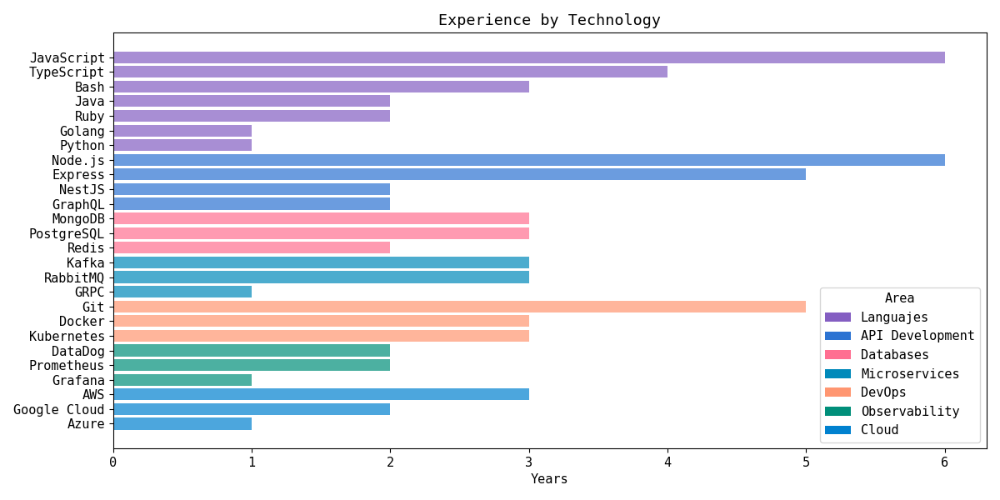

# Python Graphic - Years of Experience by Technology
This repository contains a Dockerized Python application that generates graphs showcasing years of
experience in different technologies. It offers a consistent and easy-to-use setup for creating
visually appealing and informative experience charts.

## Running
Run the following script:
```sh
$ ./run.sh
```
The image will be generated at `./output/plot.png`:


